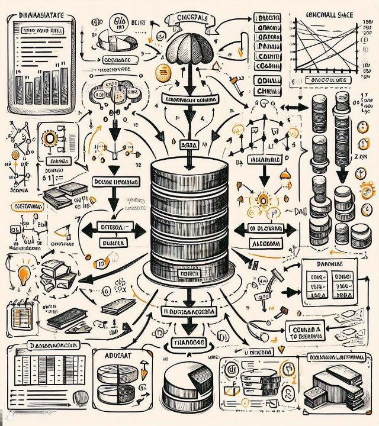
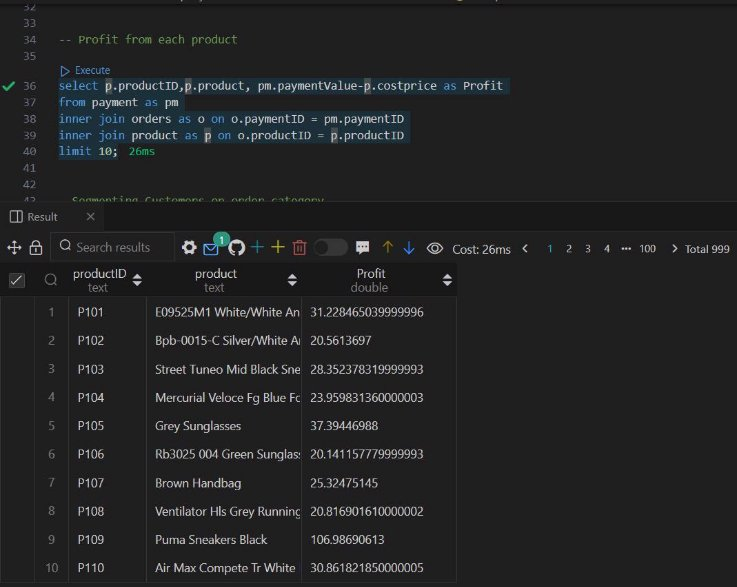

**Data management for Analytics Project Milestone-1** 

**Real world business problem definition** 

A database model for an online shopping system must be able to hold data on the users who register on the website and place orders. The products that are for sale must also be listed, together with their prices and stock information. Before placing their order, customers must be allowed to add things they choose from the catalog to a shopping cart. Each consumer should then be able to keep track of their wish list, which is a collection of goods they are considering buying but haven't yet put in their shopping cart. The data model must be able to record the order information and payment when the customer confirms an order. 

**Conceptual Data Model for E-Commerce Website and it’s Entities** 

The first step in creating a conceptual database model for an e-commerce website is to list all the system entities and their attributes. The following entities can be found in the majority of online purchasing data models: 

- **Customer**: This entity stands for users of the online shopping platform who register and create accounts in order to place orders. 
- **Product:** Describes the assortment of goods that may be purchased via the platform. 
- **Category:** The groups of products that make up this category. 
- **Order:** Purchase orders made by clients. 
- **Items :** included in an order are referred to as order items. 
- **Payment :** The sum the consumer pays after the order has been fulfilled. 
- **Shipment** : Shipping details for an order, such as the delivery address and the tracking number, are referred to as the "shipment" details. 
- **Cart**: The customer's electronic shopping bag or basket, which holds products until they are bought and added to an order. 
- **Wishlist :** The customer's wish list contains the things they have selected for potential future purchases. 

**Extended Entity-Relationship** 

1. **Customer and Order:** Customer and Order have a one-to-many relationship, which means a single customer can place several orders, but only one customer is linked to each order. 
1. **Order and Order Item:** The connection between an order and an order item is one to many. This implies that while a single order may include many items (products), each order item is associated with a particular order. You can keep track of the products inside each order thanks to this relationship. 
1. **Order Item and Product:** Order Item and Product are related in a many-to-one manner. Although a product may be tied to more than one order item, each order item is associated with a single product. This connection makes it easier to connect the particular product in each order item. 
1. **Payment and Order:** Order and Payment have a one-to-many relationship. One payment may be made for each order, however several orders may be connected to one payment. This connection makes it possible to keep track of payments made for each order. 
1. **Shipment and Order**: There is also a one-to-many relationship between Shipment and Order. Each order can have one shipment, but a shipment can be associated with multiple orders. This relationship helps manage the shipping process for each order. 
1. **Product and Category:** One product belongs to one category, but a category might have several products because there is a one-to-many relationship between the two. This association categorizes products for simpler management and browsing. 
1. **Customer, Cart, and Wishlist:** Both Cart and Wishlist are dependent entities of Customer, which implies that they maintain a dependency relationship with the Customer entity. Each customer can have one shopping cart and one wish list. 
1. **Cart and Wishlist with Product:** There are many-to-one links between the entities Cart and Wishlist and Product. This indicates that a single product may be linked to each instance of the 

   Cart and Wishlist. Customers can add multiple products to their cart and Wishlist, but each product is associated with a specific cart or Wishlist. 

9. **Product and order Item :** A many-to-one relationship can be used to define the relationship between a product and an order item. Several order items can be related to the same product, which can be the case for multiple goods in various orders.
9. **Cart and Customer :** Each customer only have one shopping cart that they use to store products they intend to buy, hence the relationship between the cart and the customer can be regarded as a one-to-one relationship.

-Payment is a weak entity 

ER Model of E commerce Website 

**Reference and Transactional data** 

**Reference Data:** 

Information that is static or semi-static and doesn't change often is represented by reference data. Reference information on an e-commerce website could consist of the following: 

1. Customer Information: 
   1. CustomerID (Primary Key) 
   1. Name 
   1. Email 
   1. Phone Number 
1. Product Information: 
   1. ProductID (Primary Key) 
   1. Name 
   1. Price 
   1. Stock 
   1. CategoryID (Foreign Key to Category) 
1. Category Information: 
   1. CategoryID (Primary Key) 
   1. Category Name 
1. Payment Methods: 
- PaymentMethodID (Primary Key) 
- Payment Method Name 

**Transactional Data:** 

Transactional data is information that is updated often and keeps track of particular transactions or events. This contains information about orders, carts, wishlists, payments, shipments, and order items in an e-commerce context: 

1. Order Information: 
   1. OrderID (Primary Key) 
   1. Order Date 
   1. Order Price 
   1. CustomerID (Foreign Key to Customer) 
1. Order Items: 
   1. OrderItemID (Primary Key) 
   1. Quantity 
   1. Price 
   1. ProductID (Foreign Key to Product) 
   1. OrderID (Foreign Key to Order) 
1. Payment Transactions: 
   1. PaymentID (Primary Key) 
   1. Payment Date 
   1. Amount 
   1. PaymentMethodID (Foreign Key to Payment Methods) 
   1. CustomerID (Foreign Key to Customer) 
   1. OrderID (Foreign Key to Order) 
1. Shipment Information: 
- ShipmentID (Primary Key) 
- Shipment Date 
- AddressID (Foreign Key to Address) 
5. Cart Information: 
   1. CartID (Primary Key) 
   1. Quantity 
   1. ProductID (Foreign Key to Product) 
   1. CustomerID (Foreign Key to Customer) 
5. Wishlist Information: 
   1. WishlistID (Primary Key) 
   1. ProductID (Foreign Key to Product) 
   1. CustomerID (Foreign Key to Customer) 
5. Address Information: 
- AddressID (Primary Key) 
- Pin 
- City 
- State 
- Country 
- Zip code 
- CustomerID (Foreign Key to Customer) 

As clients engage with the e-commerce website, particular transactional data can be recorded and kept in each of these tables. This structure enables you to efficiently support the operations and functionality of the online shopping system by storing and managing both reference data and transactional data. 

Milestone-2 

UML diagram of Proposed E commerce website model 

**A Relational model from Conceptual model:** 

**Customer** (CustomerID, Name, Email, Phone Number, AddressID) 

**Address** (AddressID, pin code, city name, state)    Primary key: AddressID 

**Shipment** (ShipmentID, CustomerID , OrderID ,Shipment Date, Address(City,      State, Country, Zip code)) 

*Forign key: CustomerID* 

*Forign key: OrderID *

**Order** (OrderID, Order Date, Order Price, Order\_itemID, PaymentID) *Forign key: Order\_itemID* 

*Foreign key : PaymentID* 

**Order\_item** (Order\_itemID, Quantity, Price, ProductID) *Forign key: ProductID* 

**Product** (ProductID, Price, Stock, CategoryID) *Forign key: ProductID* 

**Category** (CategoryID, Name) 

**Payment** (PaymentID, Payment method, Payment Date, Amount, CustomerID) 

*Primary key: CustomerID* 

**Cart** (CartID, Quantity, ProductID) *Forign key: ProductID* 

**Wishlist** (WishlistID, ProductID) *Forign key: ProductID* 

**Up to 3.5 Normalized form of above relational model as given below** 

1. Customer (CustomerID, Name, Email, Billing phone,cityname) 
1. Address (AddressID, Pin, City, State, Country, Zip code) 
1. Shipment  (ShipmentID,  OrderID,AddressID) 
   1. Foreign key: CustomerID 
   1. Foreign key: OrderID 
   1. Foreign key: AdressID 
1. Order (customerID,Product,ProductID) 
1. Payment (PaymentID, Payment method,Payment value,) 
1. Cart ( CustomerID, ProductID) 
- *Foreign key: CustomerID* 
- *Foreign key: ProductID* 
7. Wishlist ( CustomerID, ProductID) 
- *Foreign key: CustomerID* 
- *Foreign key: ProductID* 
8. Product (ProductID, Product, Brand, Category) 

In this normalized structure: 

- Customer data can be found in the "Customer" table. 
- Addresses are kept in the "Address" table and are connected to clients via CustomerID. 
- The AddressID foreign key is used to retrieve shipment details from the "Address" table. 
- The transfer of order items to their own "OrderItem" database simplifies orders. 
- Payment data is associated with specific clients. 
- Wishlists and shopping carts are connected to clients. 
- Product data is kept apart from the "Product" table, which has a foreign key called CategoryID to link products to categories. 
- Distinct categories are kept up to date. 

**Milestone -3** 

1. **Total sales by product category:** 

SELECT p.category, SUM(o.quantity \* p.costprice) AS total\_sales FROM product p 

JOIN orders o ON p.productID = o.productID 

GROUP BY p.category limit 10; 

Total Sales by Product Category: This query aims to identify the product categories that generate the most sales by calculating the total sales for each category. This information can be used to make informed decisions about inventory management, product development, and marketing strategies. ![ref1]

2. **Average order value by customer:** 

SELECT c.cutomerID, AVG(o.quantity \* p.costprice) AS average\_order\_value FROM customer as c 

JOIN orders as o ON c.cutomerID = o.cutomerID 

JOIN product p ON o.productID = p.productID 

GROUP BY c.cutomerID limit 10; 

Average Order Value by Customer: This query calculates the average order value for each customer, providing insights into customer purchasing behavior and spending patterns. This information can be used to identify high-value customers and tailor marketing strategies accordingly. 

**Top 10 customers by order count:** 

select o.cutomerID,p.product, o.quantity from orders as o join product as p on p.productID = o.productID 

order by quantity desc 

LIMIT 10; 

Top 10 Customers by Order Count: This query identifies the top 10 customers who have placed the most orders, revealing the most loyal and engaged customer base. This information can be used to focus customer retention efforts and develop targeted loyalty programs. 

**Average order value by payment method:** 

SELECT pm.payment\_method, AVG(o.quantity \* pm.paymentValue) AS average\_order\_value FROM payment pm 

JOIN orders o ON pm.paymentID = o.paymentID 

JOIN product p ON o.productID = p.productID 

GROUP BY pm.payment\_method; 

Average Order Value by Payment Method: This query analyzes the average order value associated with different payment methods, providing insights into customer preferences and the effectiveness of payment options. This information can be used to optimize payment gateways and enhance customer checkout experiences. 

**Top 10 most abandoned items in carts:** 

SELECT c.productID, p.product, COUNT(\*) AS abandoned\_count FROM cart c 

LEFT JOIN orders o ON c.productID = o.productID 

JOIN product p ON c.productID = p.productID 

WHERE o.productID IS NULL 

GROUP BY c.productID, p.product 

ORDER BY abandoned\_count DESC 

LIMIT 10; 

Top 10 Most Abandoned Items in Carts: This query identifies the products that are most frequently added to carts but not purchased, revealing potential conversion issues or product abandonment patterns. This information can be used to improve product recommendations, optimize product listings, and enhance cart abandonment recovery strategies. 

**Customer lifetime value (CLTV) for each customer: **

SELECT c.cutomerID, SUM(o.quantity \* p.costprice) AS total\_spent FROM customer c 

JOIN orders o ON c.cutomerID = o.cutomerID 

JOIN product p ON o.productID = p.productID 

GROUP BY c.cutomerID order by total\_spent desc limit 10; 

Customer Lifetime Value (CLTV) for Each Customer: This query identifies the top 10 customers with the highest lifetime value, providing insights into the most profitable and loyal customer segments. This information can be used to develop targeted customer retention strategies and optimize marketing campaigns. 

**Profit from each product** 

select p.productID,p.product, pm.paymentValue-p.costprice as Profit from payment as pm inner join orders as o on o.paymentID = pm.paymentID 

inner join product as p on o.productID = p.productID 

limit 10; 

Profit from Each Product: This query calculates the profit generated by each product by subtracting the cost price from the payment value. This information can be used to identify the most profitable products and prioritize inventory management and marketing efforts accordingly. ![ref1]

**Product conversion rate from wishlist to purchase**: 

SELECT p.productID, p.product, COUNT( w.productID) AS wishlist\_count, COUNT(DISTINCT o.orderID) AS purchase\_count 

FROM product p 

LEFT JOIN whishlist w ON p.productID = w.productID 

LEFT JOIN orders o ON p.productID = o.productID 

GROUP BY p.productID, p.product 

order by wishlist\_count desc limit 10; 

Product Conversion Rate from Wishlist to Purchase: This query analyzes the conversion rate of products from wishlists to purchases, providing insights into the effectiveness of product recommendations and customer engagement strategies. This information can be used to optimize product listings, improve product discovery, and enhance cart abandonment recovery techniques. 

**Determine the top 5 brands with the highest total sales.** 

SELECT p.brand, sum(o.quantity \* pm.paymentValue) as Total\_Sales\_Value FROM product as p inner join orders o on o.productID = p.productID 

inner join payment as pm on pm.paymentID = o.paymentID 

GROUP BY p.Brand 

ORDER BY Total\_Sales\_Value DESC 

Limit 10; 

Top 5 Brands with the Highest Total Sales: This query identifies the top 5 brands that generate the most sales, revealing the most successful and popular brands. This information can be used to negotiate better deals with suppliers, develop targeted marketing campaigns, and enhance brand positioning strategies. 

2\. Determine the average shipping time for orders placed during a specific time period 

SELECT CEILING(AVG(DATEDIFF(s.shipmentDate, o.orderDate))) AS Average\_shipping\_time\_In\_days, 

CEILING(min(DATEDIFF(s.shipmentDate, o.orderDate))) as Minimum\_shipping\_time\_In\_days, CEILING(max(DATEDIFF(s.shipmentDate, o.orderDate))) as Maximum\_shipping\_time\_In\_days FROM orders o 

JOIN shipments s ON o.orderID = s.orderID; 

Average Shipping Time for Orders: This query calculates the average, minimum, and maximum shipping time for orders, providing insights into order fulfillment efficiency and potential delivery issues. This information can be used to optimize shipping processes, set realistic delivery expectations, and improve customer satisfaction. 

![ref2] ![ref3]

`        `     ![ref4]

` `

    ![ref4]           

` `

` `

![ref5] 

` `

` `

![ref5] 

` `![ref2]

` `

![ref5] 

![ref2] ![ref3]

` `

![ref5] 

` `

![ref5] 

Data Management for Analytics
# Data Model for E -Commerce 
# Website![ref6]
Group 5

- Rohit Reddy
- Rakshith Dharmappa

## Agenda 
01\. Introduction 02. Entities 

The database captures user  details, orders, products,  carts, wishlists, order  specifics, and payment  information for an online  shopping platform. ![ref6]

03\. ER and UML 04. Conceptual DB  05. SQL & NoSQL and Its Normalized  form 

## Problem Statement: - 
## Introduction - ![ref7]
Welcome to our E-commerce Database Model  Presentation. Our system is tailored to manage  user details, orders, product listings with prices  and stocks, carts, Wishlist, and payment  information for seamless online shopping. The  model showcases entities like Customers,  Products, Orders, Payments, Shipments, and  their relationships. It ensures efficient  ![ref8]operations by allowing users to register, place  orders, add products to carts or wishlists, and  finalize payments. Join us as we explore how  our model optimizes the online shopping  experience. 

2. Entities

•This entity stands for users of the online shopping platform who register and create accounts in order to place orders. Customer

- Describes the assortment of goods that may be purchased via the platform.

Product

- Purchase orders made by clients.

Order

- Included in an order are referred to as order items.

Items

- The sum the consumer pays after the order has been fulfilled.

Payment

•Shipping details for an order, such as the delivery address and the tracking number, are referred to as the "shipment" details Shipment

•The customer's electronic shopping bag or basket, which holds products until they are bought and added to an order

Cart

•The customer's wish list contains the things they have selected for potential future purchases.

Wishlist

3. ER and UML

  

4. Converting our Conceptual D B to Relational Data Base and to Its Normalized form ![ref7]

But Why ![ref8]
## **Data Integrity:** Relational  
## databases ensure data integrity by enforcing  **Reduction of Anomalies:** Normalization minimizes data anomalies like constraints like primary keys, foreign keys, 
and relationships. This prevents anomalies  insertion, update, and deletion anomalies, ensuring the database remains

and inconsistencies in data. in a consistent state.

**Scalability:** Normalized databases are **Easier Maintenance:** With a well-normalized generally more scalable. As data grows, 

relational database, maintenance becomes  the structure can accommodate changes more straightforward. It's easier to  and expansions without significant troubleshoot issues and maintain the overall  alterations, maintaining efficiency.

health of the database.

**Efficient Data Storage :** Normalization

reduces data redundancy by organizing data into **Industry Standard:** Relational  smaller, more manageable tables. This results in 

databases follow industry-standard **Improved Query**  efficient use of storage space and reduces 

` `practices, making it easier for  the chances of inconsistencies.

developers and analysts to  **Performance:** Relational 

work with and understand the  databases with normalized tables  **Data Consistency:** Relational databases database structure. often perform better in queries.  promote consistent data across tables. 

Normalization allows for smaller  Updates or changes made in one place 

tables that can be joined efficiently,  reflect uniformly across related tables, leading to faster query execution. ensuring consistency.
## 05(A) SQL
Total sales by product category: **Average order value by customer **

SELECT p.category, SUM(o.quantity \* p.costprice) AS  SELECT c.cutomerID, 

total\_sales  AVG(o.quantity \* p.costprice) AS average\_order\_value FROM product p  FROM customer as c 

JOIN orders o ON p.productID = o.productID  JOIN orders as o ON c.cutomerID = o.cutomerID 

GROUP BY  category limit 10; JOIN product p ON o.productID = p.productID 

GROUP BY c.cutomerID limit 10;

**Top most abandoned item in carts  Profit from each product**  Segmenting Customers on order 

category

SELECT c.productID, p.product,  select p.productID,p.product,  SELECT p.category, c.`cutomerID`, COUNT(\*) AS abandoned\_count FROM pm.paymentValue-p.costprice as c.`Name`, COUNT(o.`orderID`) as 

cart c LEFT JOIN orders o ON Profit from payment as pm inner 

c.productID = o.productID JOIN join orders as o on o.paymentID =  tFoRtOaMl\_porroddeurcst as p

productp.produ pctID ONWHERc.proE ductIDo.produ=ctID IS pm.paymentID inner join product as JOIN orders as o ON p.`productID` = NULL GROUP BY c.productID, p.product p on o.productID = p.productID o.`productID`

ORDER BY abandoned\_count DESC LIMIT limit 10; JcO.I`NcuctuosmteormIeDr` as c ON o.`cutomerID` = 10; GROUP BY p.category, c.`cutomerID`, 

c.`Name`

ORDER BY p.category, total\_orders DESC
## 05(B) NoSQL
**The average selling price of each product The total quantity of each product **

**sold**

use("ecomsite") use('ecomsite’) db.customerdata.aggregate([

{ $group: { \_id: "$productName", 

avgSellingPrice: { $avg: db.{cu$sgtroomuepr:da{ta\_.iadg:gr"e$gpartoed(u[ctName", "$sellingPrice" } } } totalQuantity: { $sum: "$Quantity" } } }

]) ])

**The top-selling product by quantity The profit from each product Find the top-selling brand**

use('ecomsite’) use('ecomsite') use('ecomsite')

db.customerdata.aggregate([{  db.customerdata.aggregate([{  db.customerdata.aggregate([ $group: { \_id: "$productName",  $group: { \_id: "$productName",  { "$group": { "\_id": totalRevenue: { $sum: {  profit: { $sum: { $subtract: [  "$Brand", "totalSold": { $multiply: [ "$Quantity",  "$sellingPrice", "$Cost\_Price" ]  "$sum": "$Quantity" } } }, "$sellingPrice" ] } } } }]) } } } }]) { "$sort": { "totalSold": -1

} },

{ "$limit": 10 } ])

- FOSSIL • NIKE
- Titan • Campus
  - FOSSIL
  - Titan

 

## Summary ![ref7]
The conceptual database model for an e-commerce platform comprises entities like  

Customer, Product, Order, Payment, Shipment, Cart, Wishlist, and Category, each  

with specific attributes and relationships. Customers place orders connected through a one-to-many relationship, while order items link orders and products, facilitating 

tracking of items in each order. Payments and shipments maintain one-to-many ties with orders, managing payment details and shipping specifics. Categories categorize products, 

aiding in organization. Reference data includes static customer and product info, 

while transactional data captures dynamic details like orders, payments, and shipments, 

crucial for the system's real-time operation and effective e-commerce functionality.
## Thank you
- Rakshith Dharmappa
- Rohith Reddy

[ref1]: ./src/Aspose.Words.97ab8d6c-5a46-493a-a322-7b8e9759d5b8.015.png
[ref2]: ./src/Aspose.Words.97ab8d6c-5a46-493a-a322-7b8e9759d5b8.032.png
[ref3]: ./src/Aspose.Words.97ab8d6c-5a46-493a-a322-7b8e9759d5b8.033.png
[ref4]: ./src/Aspose.Words.97ab8d6c-5a46-493a-a322-7b8e9759d5b8.043.png
[ref5]: ./src/Aspose.Words.97ab8d6c-5a46-493a-a322-7b8e9759d5b8.070.png
[ref6]: ./src/Aspose.Words.97ab8d6c-5a46-493a-a322-7b8e9759d5b8.094.png
[ref7]: ./src/Aspose.Words.97ab8d6c-5a46-493a-a322-7b8e9759d5b8.107.png
[ref8]: ./src/Aspose.Words.97ab8d6c-5a46-493a-a322-7b8e9759d5b8.108.png
